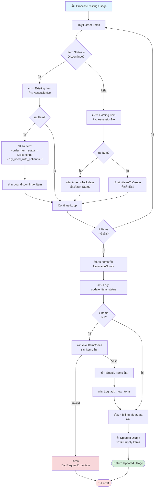

# Flowchart: Medical Supply Usage Create Function

## Overview
ฟังก์ชัน `create` ใช้สำหรับสร้างหรืออัปเดต Medical Supply Usage records โดยรองรับทั้งรูปแบบใหม่ (Order format) และรูปแบบเก่า (Legacy supplies format)

---

## Main Flow

---

## Process Existing Usage (Detailed)

---

## Process Discontinue Items (When No Existing Usage)

---

## Create New Usage (Detailed)

---

## Key Decision Points

### 1. Existing Usage Check
- **เงื่อนไข**: EN + HN + FirstName + Lastname ตรงกัน
- **ผลลัพธ์**: 
  - มี → Process Existing Usage
  - ไม่มี → Process Discontinue Items → Create New Usage

### 2. Discontinue Item Processing
- **เมื่อมี Existing Usage**: ประมวลผลใน Process Existing Usage loop
- **เมื่อไม่มี Existing Usage**: ประมวลผลแยกก่อนสร้าง Usage ใหม่

### 3. Item Matching Logic
- **ใช้ AssessionNo** เป็น key ในการ match
- **ถ้า AssessionNo ตรง**: อัปเดต Status
- **ถ้า AssessionNo ไม่ตรง**: สร้าง Item ใหม่

### 4. Validation
- **ตรวจสอบ ItemCodes** ก่อนสร้าง Items ใหม่
- **ไม่ตรวจสอบ** สำหรับ Discontinue Items (เพราะใช้แค่ยกเลิก Items เดิม)

---

## Error Handling

---

## Summary

ฟังก์ชันนี้มี 3 เส้นทางหลัก:

1. **Existing Usage Path**: อัปเดต Usage ที่มีอยู่แล้ว
   - ประมวลผล Discontinue Items
   - อัปเดต Items ที่มี AssessionNo ตรง
   - สร้าง Items ใหม่ที่ไม่มี AssessionNo ตรง

2. **Discontinue Only Path**: มีแค่ Discontinue Items (ไม่มี Existing Usage)
   - ค้นหา Usages ใน Episode เดียวกัน
   - อัปเดต Items ที่มี AssessionNo ตรงเป็น Discontinue
   - Return Updated Usage

3. **New Usage Path**: สร้าง Usage ใหม่
   - ตรวจสอบ ItemCodes
   - สร้าง Usage พร้อม Supply Items
   - Return New Usage
